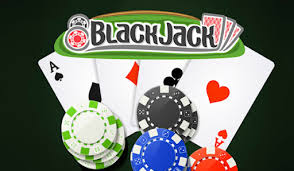

# Blackjack

This repository consists of creating the blackjack game using JavaScript

## Instructions

- Create 3 buttons (STAND, DROP and RESTART).
- Compute the sum of the current die plus the previous die, i.e. the total.
- Keep a record of all the moves
- If you go over 21, you lose
- If you get a score between 21 and 18, you win.
- If you don't reach 18, I send you a message like: chicken.
